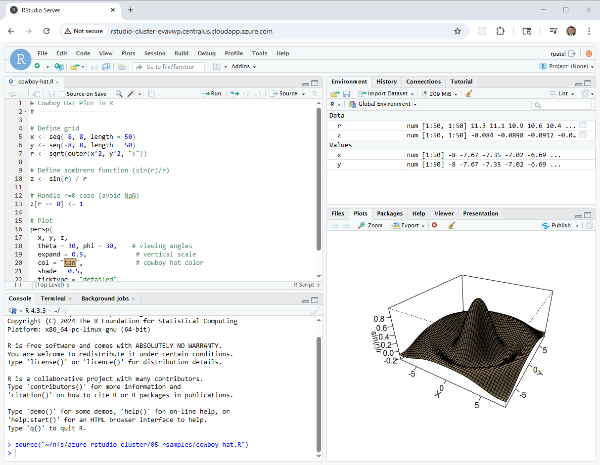
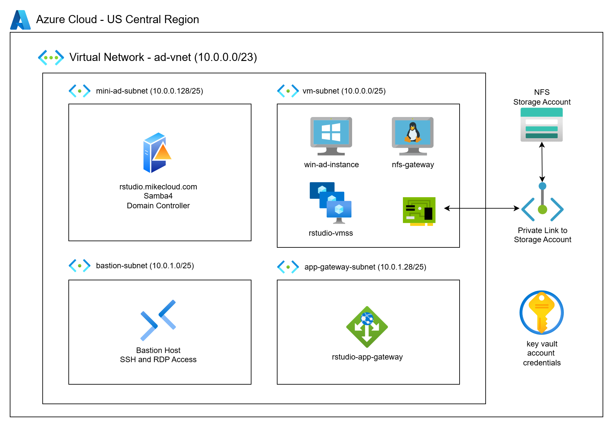
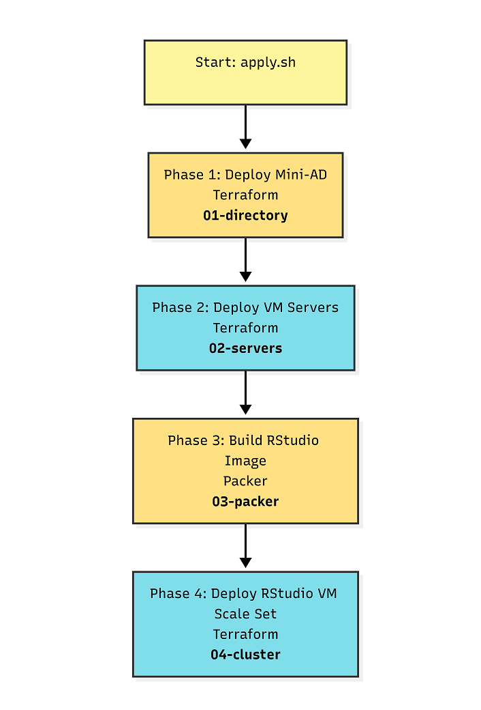
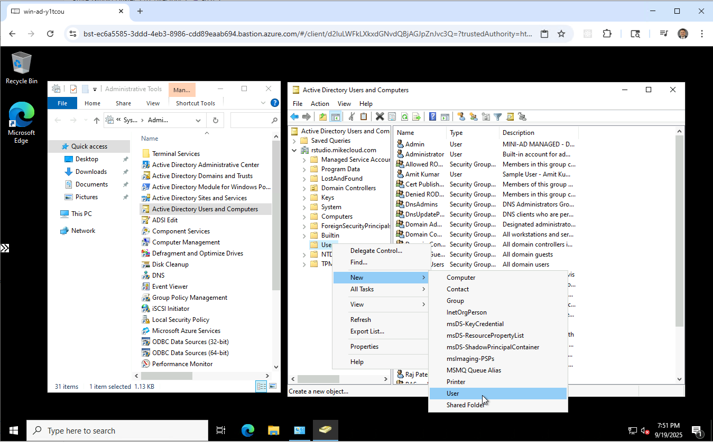
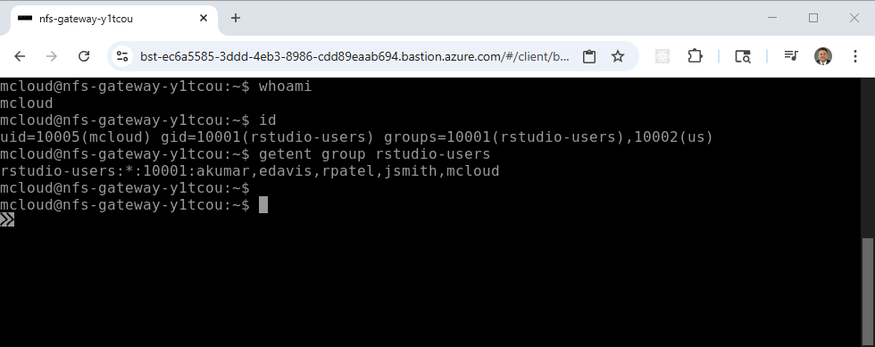

# Azure RStudio Cluster

Standing up a shared RStudio environment shouldn't take a week or cost a fortune.

This project deploys a production-ready RStudio Server cluster on Azure — built for small teams that need a controlled, consistent R environment without the overhead of managing individual workstations or ad-hoc VMs. The whole stack deploys in one script and is up and running in about 45 minutes.



Users authenticate with named domain accounts, every node runs an identical environment, and R packages installed by admins are instantly available across the entire cluster via a shared Azure Files NFS mount.

### Key capabilities demonstrated:

1. **RStudio Server Cluster with Application Gateway** – RStudio Server (Open Source Edition) deployed across multiple VM instances, fronted by an Azure Application Gateway for high availability and seamless user access.
2. **Azure Files-Backed Shared Library** – Azure Files share mounted at `/nfs/rlibs` and injected into `.libPaths()`, enabling shared R package storage across the cluster.
3. **Built-in Authentication** – A lightweight Samba domain controller ships with the stack, providing named user logins and group-based permissions with no external identity service required.

  
## Prerequisites  

* [An Azure Account](https://portal.azure.com/)
* [Install AZ CLI](https://learn.microsoft.com/en-us/cli/azure/install-azure-cli) 
* [Install Latest Terraform](https://developer.hashicorp.com/terraform/install)
* [Install Latest Packer](https://developer.hashicorp.com/packer/install)

If this is your first time watching our content, we recommend starting with this video: [Azure + Terraform: Easy Setup](https://www.youtube.com/watch?v=wwi3kVgYNOk). It provides a step-by-step guide to properly configure Terraform, Packer, and the AZ CLI.

## Build WorkFlow




## Download this Repository  

```bash
git clone https://github.com/mamonaco1973/azure-rstudio-cluster.git
cd azure-rstudio-cluster
```  

## Build the Code  

Run [check_env](check_env.sh) to validate your environment, then run [apply](apply.sh) to provision the infrastructure.  

```bash
develop-vm:~/azure-rstudio-cluster$ ./apply.sh
NOTE: Validating that required commands are in PATH.
NOTE: az is found in the current PATH.
NOTE: terraform is found in the current PATH.
NOTE: All required commands are available.
NOTE: Checking Azure CLI connection.
NOTE: Successfully logged into Azure.
Initializing provider plugins...
Terraform has been successfully initialized!
```  

### Build Results  

When the deployment completes, the following resources are created:  

- **Resource Groups:**  
  - **rstudio-mini-ad-rg** - Mini-AD components
  - **rstudio-network-rg** – Networking and Key Vault  
  - **rstudio-servers-rg** – Domain-joined Linux/Windows servers and storage integration  
  - **rstudio-vmss-rg** – RStudio VM Scale Set (VMSS), Application Gateway, and related cluster infra  

- **Networking:**  
  - A VNet with dedicated subnets for Active Directory, VMSS cluster nodes, and Application Gateway  
  - NAT Gateway for deterministic outbound internet access  
  - An `AzureBastionSubnet` is pre-provisioned; Azure Bastion deploys only when `bastion_support=true` (default: false)  

- **Security & Identity:**  
  - NSGs for domain controller, VMSS nodes, and storage endpoints  
  - Azure Key Vault for credential storage (admin + user accounts)  
  - Managed Identities for VMSS instances to retrieve secrets from Key Vault  

- **Active Directory Server:**  
  - Ubuntu VM running Samba 4 as Domain Controller and DNS server  
  - Configured Kerberos realm and NetBIOS name for authentication  
  - Administrator credentials securely stored in Key Vault  

- **RStudio Cluster (VMSS):**  
  - Linux VM Scale Set (VMSS) hosting RStudio Server nodes built from a Packer-generated custom image  
  - Azure Application Gateway providing public access, load balancing, health probes, and cookie-based affinity  
  - Autoscaling policies to add/remove RStudio nodes based on CPU utilization  

- **Azure Files Storage:**  
  - Premium Storage Account with SMB and NFS protocol enabled  
  - File shares provisioned for shared R libraries (`/nfs/rlibs`) and user home directories  

- **File Access Integration:**  
  - RStudio VMSS instances mount the Azure Files NFS share for shared R libraries and project data  
  - Domain-joined Windows clients (optional) can connect directly via SMB to the same Azure Files shares  
  - This provides a unified storage backend across Linux (NFS) and Windows (SMB) clients  

- **Sample R Workloads:**  
  - Example R scripts (Monte Carlo, bell curve, surface plotting, etc.) included to validate the environment  

### Users and Groups  

The domain controller provisions **sample users and groups** via Terraform templates. These are intended for testing and demonstration.  

#### Groups Created  

| Group Name    | Category  | Scope     | gidNumber |
|---------------|-----------|----------|-----------|
| rstudio-users  | Security  | Universal | 10001 |
| india         | Security  | Universal | 10002 |
| us            | Security  | Universal | 10003 |
| linux-admins  | Security  | Universal | 10004 |
| rstudio-admins  | Security  | Universal | 10005 |

#### Users Created  

| Username | Full Name   | uidNumber | gidNumber | Groups Joined                    |
|----------|-------------|-----------|-----------|----------------------------------|
| jsmith   | John Smith  | 10001     | 10001     | rstudio-users, us, linux-admins, rstudio-admins  |
| edavis   | Emily Davis | 10002     | 10001     | rstudio-users, us                 |
| rpatel   | Raj Patel   | 10003     | 10001     | rstudio-users, india, linux-admins, rstudio-admins|
| akumar   | Amit Kumar  | 10004     | 10001     | rstudio-users, india              |

### Creating a New RStudio User

Follow these steps to provision a new user in the Active Directory domain and validate their access to the RStudio cluster:

1. **Connect to the Domain Controller**  
   - Log into the **`win-ad`** server via RDP.
   - Use the `rpatel` or `jsmith` credentials that were provisioned during cluster deployment.  

2. **Launch Active Directory Users and Computers (ADUC)**  
   - From the Windows Start menu, open **“Active Directory Users and Computers.”**  
   - Enable **Advanced Features** under the **View** menu. This ensures you can access the extended attribute tabs (e.g., UID/GID mappings).  

3. **Navigate to the Users Organizational Unit (OU)**  
   - In the left-hand tree, expand the domain (e.g., `rstudio.mikecloud.com`).  
   - Select the **Users** OU where all cluster accounts are managed.  

4. **Create a New User Object**  
   - Right-click the Users OU and choose **New → User.**  
   - Provide the following:  
     - **Full Name:** Descriptive user name (e.g., “Mike Cloud”).  
     - **User Logon Name (User Principal Name / UPN):** e.g., `mcloud@rstudio.mikecloud.com`.  
     - **Initial Password:** Set an initial password.



5. **Assign a Unique UID Number**  
   - Open **PowerShell** on the AD server.  
   - Run the script located at:  
     ```powershell
     Z:\nfs\azure-rstudio-cluster\06-utils\getNextUID.bat
     ```  
   - This script returns the next available **`uidNumber`** to assign to the new account.  

6. **Configure Advanced Attributes**  
   - In the new user’s **Properties** dialog, open the **Attribute Editor** tab.  
   - Set the following values:  
     - `gidNumber` → **10001** (the shared GID for the `rstudio-users` group).  
     - `uid` → match the user’s AD login ID (e.g., `rpatel`).  
     - `uidNumber` → the unique numeric value returned from `getNextUID.ps1`.  

7. **Add Group Memberships**  
   - Go to the **Member Of** tab.  
   - Add the user to the following groups:  
     - **rstudio-users** → grants standard RStudio access.  
     - **us** (or other geographic/departmental group as applicable).  

8. **Validate User on Linux**  
   - Open an **SSH** session to the **`nfs-gateway`** instance.  
   - Run the following command to confirm the user’s identity mapping:  
     ```bash
     id mcloud
     ```  
   - Verify that the output shows the correct **UID**, **GID**, and group memberships (e.g., `rstudio-users`).  



9. **Validate RStudio Access**  
   - Open the RStudio cluster’s Application Gateway's URL in a browser (e.g., `http://rstudio-cluster-xxxxx.centralus.cloudapp.azure.com/`).  
   - Log in with the new AD credentials.  

10. **Verify Permissions**  
   - By default, the new user is **not** a member of the `rstudio-admins` group.  
   - Attempting to install packages into the **shared library path `/nfs/rlibs`** should fail with a **”Permission denied”** error.  
   - This confirms the user is restricted to installing packages in their **personal user library** only.  

---

✅ **Note:** If you need the user to have administrative rights (e.g., the ability to install packages into the shared library), add them to the **rstudio-admins** group in addition to `rstudio-users`.

### Changing the Domain Name

The default domain is `rstudio.mikecloud.com`. The recommended way to override it is via the `TF_VAR_*` environment variables already stubbed out at the top of both [apply.sh](apply.sh) and [destroy.sh](destroy.sh):

```bash
export TF_VAR_dns_zone="datascience.acme.com"
export TF_VAR_realm="DATASCIENCE.ACME.COM"
export TF_VAR_netbios="DATASCIENCE"
export TF_VAR_user_base_dn="CN=Users,DC=datascience,DC=acme,DC=com"
```

Uncomment those lines before running `apply.sh`, and uncomment the matching block in `destroy.sh` before tearing down — Terraform picks them up automatically across all phases with no changes to any `variables.tf` file required.

The AD group names (e.g., `datascience-users`, `datascience-admins`) and the SSSD forced group are derived automatically from `TF_VAR_netbios` — no other changes are required.

### Clean Up  

When finished, remove all resources with:  

```bash
./destroy.sh
```  

This uses Terraform to delete the VNet, VMs, Key Vault, storage accounts, NSGs, and secrets.  


