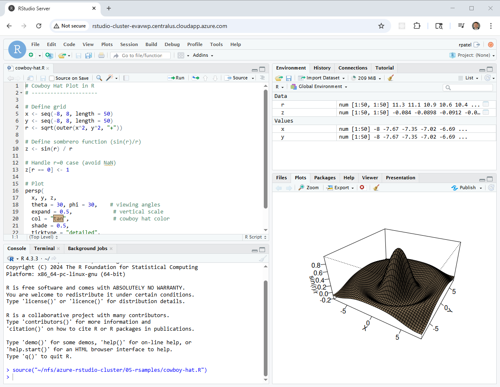

# Azure RStudio Cluster with Azure Files-Backed Shared Libraries  

This project extends the original **Azure Mini Active Directory** lab by deploying an **RStudio Server cluster** on Microsoft Azure. The cluster is designed for data science and analytics workloads, where multiple users need a scalable, domain-joined environment with consistent package management.  

  

Instead of relying only on per-user libraries stored on ephemeral VM disks, this solution integrates **Azure Files** as a shared package and data backend. This allows RStudio nodes in a **Virtual Machine Scale Set (VMSS)** to mount a common Azure Files share, ensuring that installed R packages and project files are accessible across all nodes.  

### Key capabilities demonstrated:  

1. **RStudio Server Cluster with Application Gateway** – RStudio Server (Open Source Edition) deployed across multiple VM instances, fronted by an Azure Application Gateway for high availability and seamless user access.  
2. **Azure Files-Backed Shared Library** – Azure Files share mounted at `/nfs/rlibs` (Linux NFS mount) and injected into `.libPaths()`, enabling shared R package storage across the cluster.  
3. **Mini Active Directory Integration** – A Samba-based mini-AD domain controller provides authentication and DNS, so RStudio logins are domain-based and centrally managed.  

Together, this architecture provides a reproducible, cloud-native RStudio environment where users get both personal home-directory libraries and access to a shared, scalable package repository.  

  
## Prerequisites  

* [An Azure Account](https://portal.azure.com/)
* [Install AZ CLI](https://learn.microsoft.com/en-us/cli/azure/install-azure-cli) 
* [Install Latest Terraform](https://developer.hashicorp.com/terraform/install)
* [Install Latest Packer](https://developer.hashicorp.com/packer/install)

If this is your first time watching our content, we recommend starting with this video: [Azure + Terraform: Easy Setup](https://www.youtube.com/watch?v=wwi3kVgYNOk). It provides a step-by-step guide to properly configure Terraform, Packer, and the AZ CLI.

---

## Download this Repository  

```bash
git clone https://github.com/mamonaco1973/azure-rstudio-cluster.git
cd azure-rstudio-cluster
```  

## Build the Code  

Run [check_env](check_env.sh) to validate your environment, then run [apply](apply.sh) to provision the infrastructure.  

```bash
develop-vm:~/azure-rstudio-cluster$ ./apply.sh
NOTE: Validating that required commands are in PATH.
NOTE: az is found in the current PATH.
NOTE: terraform is found in the current PATH.
NOTE: All required commands are available.
NOTE: Checking Azure CLI connection.
NOTE: Successfully logged into Azure.
Initializing provider plugins...
Terraform has been successfully initialized!
```  

### Build Results  

When the deployment completes, the following resources are created:  

- **Networking:**  
  - A VNet with public and private subnets  
  - Azure Bastion for secure RDP/SSH without public IPs  
  - Route tables configured for AD, clients, and storage access  

- **Security & Identity:**  
  - NSGs for domain controller, Linux client, Windows client, and storage access  
  - Azure Key Vault for credential storage (admin + user accounts)  
  - Managed Identities for VM-to-Key Vault secret retrieval  

- **Active Directory Server:**  
  - Ubuntu VM running Samba 4 as Domain Controller and DNS server  
  - Configured Kerberos realm and NetBIOS name  
  - Administrator credentials stored in Key Vault  

- **Client Instances:**  
  - Windows VM joined to the domain via boot-time PowerShell script  
  - Linux VM joined to the domain with SSSD integration via cloud-init  

- **Azure Files Storage:**  
  - Premium Storage Account with SMB and/or NFS protocol enabled  
  - File shares provisioned for shared data and home directories  

- **File Access Integration:**  
  - A Linux VM mounts the Azure Files NFS share  
  - The same Linux VM exposes the mounted share via **Samba**, acting as a gateway for Windows clients  
  - This enables domain-joined Windows machines to access Azure Files storage transparently using SMB, while Linux clients mount NFS directly  

### Users and Groups  

The domain controller provisions **sample users and groups** via Terraform templates. These are intended for testing and demonstration.  

#### Groups Created  

| Group Name    | Category  | Scope     | gidNumber |
|---------------|-----------|----------|-----------|
| rstudio-users  | Security  | Universal | 10001 |
| india         | Security  | Universal | 10002 |
| us            | Security  | Universal | 10003 |
| linux-admins  | Security  | Universal | 10004 |
| rstudio-admins  | Security  | Universal | 10004 |

#### Users Created  

| Username | Full Name   | uidNumber | gidNumber | Groups Joined                    |
|----------|-------------|-----------|-----------|----------------------------------|
| jsmith   | John Smith  | 10001     | 10001     | mcloud-users, us, linux-admins, rstudio-admins  |
| edavis   | Emily Davis | 10002     | 10001     | mcloud-users, us                 |
| rpatel   | Raj Patel   | 10003     | 10001     | mcloud-users, india, linux-admins, rstudio-admins|
| akumar   | Amit Kumar  | 10004     | 10001     | mcloud-users, india              |

### Creating a New RStudio User

Follow these steps to provision a new user in the Active Directory domain and validate their access to the RStudio cluster:

1. **Connect to the Domain Controller**  
   - Log into the **`win-ad`** server via **Bastion**
   - Use the `rpatel` or `jsmith` credentials that were provisioned during cluster deployment.  

2. **Launch Active Directory Users and Computers (ADUC)**  
   - From the Windows Start menu, open **“Active Directory Users and Computers.”**  
   - Enable **Advanced Features** under the **View** menu. This ensures you can access the extended attribute tabs (e.g., UID/GID mappings).  

3. **Navigate to the Users Organizational Unit (OU)**  
   - In the left-hand tree, expand the domain (e.g., `rstudio.mikecloud.com`).  
   - Select the **Users** OU where all cluster accounts are managed.  

4. **Create a New User Object**  
   - Right-click the Users OU and choose **New → User.**  
   - Provide the following:  
     - **Full Name:** Descriptive user name (e.g., “Mike Cloud”).  
     - **User Logon Name (User Principal Name / UPN):** e.g., `mcloud@rstudio.mikecloud.com`.  
     - **Initial Password:** Set an initial password.


5. **Assign a Unique UID Number**  
   - Open **PowerShell** on the AD server.  
   - Run the script located at:  
     ```powershell
     Z:\nfs\azure-rstudio-cluster\06-utils\getNextUID.bat
     ```  
   - This script returns the next available **`uidNumber`** to assign to the new account.  

6. **Configure Advanced Attributes**  
   - In the new user’s **Properties** dialog, open the **Attribute Editor** tab.  
   - Set the following values:  
     - `gidNumber` → **10001** (the shared GID for the `rstudio-users` group).  
     - `uid` → match the user’s AD login ID (e.g., `rpatel`).  
     - `uidNumber` → the unique numeric value returned from `getNextUID.ps1`.  

7. **Add Group Memberships**  
   - Go to the **Member Of** tab.  
   - Add the user to the following groups:  
     - **rstudio-users** → grants standard RStudio access.  
     - **us** (or other geographic/departmental group as applicable).  

8. **Validate User on Linux**  
   - Open an **Bastion** session to the **`nfs-gateway`** instance.  
   - Run the following command to confirm the user’s identity mapping:  
     ```bash
     id mcloud
     ```  
   - Verify that the output shows the correct **UID**, **GID**, and group memberships (e.g., `rstudio-users`).  


9. **Validate RStudio Access**  
   - Open the RStudio cluster’s Application Load Balancer (ALB) URL in a browser (e.g., `https://rstudio-alb-xxxxxx.us-east-1.elb.amazonaws.com`).  
   - Log in with the new AD credentials.  

10. **Verify Permissions**  
   - By default, the new user is **not** a member of the `rstudio-admin` group.  
   - Attempting to install packages into the **shared library path `/nfs/rlibs`** should fail with a **“Permission denied”** error.  
   - This confirms the user is restricted to installing packages in their **personal user library** only.  

---

✅ **Note:** If you need the user to have administrative rights (e.g., the ability to install packages into the shared library), add them to the **rstudio-admin** group in addition to `rstudio-users`.

### Clean Up  

When finished, remove all resources with:  

```bash
./destroy.sh
```  

This uses Terraform to delete the VNet, VMs, Key Vault, storage accounts, NSGs, and secrets.  


